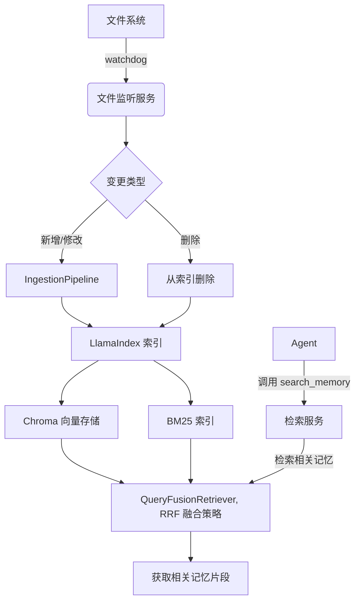

# SmartClaw RAG 模块开发规范 (DEV_SPEC)

## 1. 模块概述

### 1.1 模块职责与边界

**核心职责**：
- 为 SmartClaw Agent 提供记忆检索能力
- 对长期记忆文件进行索引构建和维护
- 实现混合检索（向量 + BM25 + RRF）
- 监控文件系统变化并触发增量索引更新

**功能边界**：
- **当前实现范围**：仅处理长期记忆（`sessions/archive/*.md`）的索引和检索
- **暂不实现**：外部知识库索引、核心记忆索引
- **外部依赖**：Agent 模块的预压缩冲刷功能（采用函数式实现）

**技术约束**：
- 异步非阻塞：索引构建必须异步执行，不得阻塞用户与 Agent 的交互
- 本地存储：所有数据存储在本地，无需外部依赖
- 透明性：索引仅作为检索加速层，原始 Markdown 文件始终完整可读

### 1.2 技术架构概述

#### 1.2.1 核心组件

SmartClaw RAG 记忆模块以 **LlamaIndex** 为核心框架，围绕“文件即记忆”的设计理念，构建了一套高效、可增量更新的混合检索系统。其技术核心由以下组件构成：

| 组件 | 作用 |
|------|------|
| **`SimpleDirectoryReader`** | 从本地目录递归读取 `.md` 文件，生成 `Document` 对象。支持通过 `required_exts` 过滤扩展名，`filename_as_id` 控制 `doc_id` 生成方式。 |
| **`MarkdownNodeParser`** | 专门解析 Markdown 文档，根据标题层级将文档分割为节点，并将标题编号和名称自动存入节点元数据（如 `section_hierarchy`、`heading`）。 |
| **`QuestionsAnsweredExtractor`** | 元数据提取器，基于每个节点的文本内容，调用 LLM 生成指定数量的问题，结果存储在 `questions_this_excerpt_can_answer` 元数据字段中。 |
| **`IngestionPipeline`** | 将原始文档转换为节点的管道，内部依次应用上述 `transformations`。它与 `docstore` 和 `cache` 集成，自动跳过未变更文档，并缓存节点+转换的结果。 |
| **`SimpleDocumentStore`** | 文档存储，记录每个文档的元数据：`doc_id`、文档哈希值、该文档下所有节点 ID 等。支持持久化为 JSON 文件。 |
| **`自定义SQLite Cache`** | 缓存每个节点与转换（如分块、嵌入）的组合结果，避免重复计算 |
| **`ChromaVectorStore`** | 向量存储，使用 Chroma 持久化客户端，保存节点的嵌入向量及元数据，用于稠密检索。 |
| **`VectorStoreIndex`** | 基于向量存储构建的索引，可生成向量检索器。 |
| **`BM25Retriever`** | 基于 BM25 算法的关键词检索器，使用 LlamaIndex 内建实现。与向量检索器共同构成双路检索。 |
| **`QueryFusionRetriever`** | 融合多个检索器的结果，支持多种融合策略。本工作流使用 `mode="reciprocal_rank"`（RRF）进行无模型重排序。 |

#### 1.2.2 技术选型依据

**LlamaIndex**：
- 提供完整的文档处理管道（解析、分块、嵌入、检索）
- 原生支持多种存储后端（Chroma、BM25）
- 内置增量更新机制，减少重复计算
- 丰富的元数据管理能力

**Chroma 向量存储**：
- 轻量级，易于部署和维护
- 支持持久化存储
- 高效的相似性检索
- 与 LlamaIndex 集成良好

**混合检索策略（向量 + BM25 + RRF）**：
- 向量检索：捕捉语义相似性，适合模糊查询
- BM25 检索：基于关键词精确匹配，适合低频词查询
- RRF 融合：无需额外模型训练，鲁棒性强，易于实现

**文件监听（watchdog）**：
- 跨平台支持
- 轻量级，性能开销小
- 事件驱动，适合实时监控

#### 索引框架与向量存储
- **LlamaIndex**：负责文档解析、文本分块、节点元数据管理以及索引构建。通过其灵活的 `IngestionPipeline` 和 `StorageContext`，实现与多种存储后端的无缝集成。
- **向量存储**：选用 **Chroma** 作为默认向量数据库，所有节点（Node）的嵌入向量持久化存储在 ` ~/.smartclaw/store/memory/chroma/` 目录。Chroma 支持高效的相似性检索，并可与 LlamaIndex 的 `VectorStoreIndex` 直接配合。
- **BM25索引存储**：BM25索引持久化存储在` ~/.smartclaw/store/memory/bm25/` 目录

#### 混合检索策略
为实现精准的语义搜索与关键词匹配的互补，系统采用**双路检索 + RRF 融合**：
- **稠密向量检索**：通过 `VectorStoreIndex` 对查询进行向量相似度搜索，召回语义相关节点。
- **稀疏检索（BM25）**：利用 `BM25Retriever` 基于关键词统计信息进行检索，弥补向量检索对低频词汇的不足。
- **融合算法**：两路检索结果通过**互惠秩融合（RRF）** 算法重排序，综合相关性得分，输出最终 Top-K 节点。RRF 无需额外训练，鲁棒性强。

#### 文档存储与增量更新
- **文档存储（DocStore）**：所有处理后的节点及其元数据持久化于后端的 `/store` 目录（如 `SimpleDocumentStore`）。DocStore 记录了每个文档的哈希值、节点列表等信息，是实现增量更新的核心。
- **缓存机制**：将 **SQLite** 集成到 LlamaIndex 的缓存层，作为 `IngestionPipeline` 的持久化缓存后端。每个节点与转换（如分块、嵌入）的组合结果被缓存，避免重复计算。
- **增量更新流程**：
  1. 文件监听模块（如 `watchdog`）检测到记忆文件（`.md`）的创建、修改或删除。
  2. 触发 LlamaIndex 的 `IngestionPipeline` 执行，仅处理变更文件。
  3. 管道通过 DocStore 比对文件哈希，识别新增或修改的文档；利用 SQLite 缓存跳过已处理的节点。
  4. 更新向量索引（Chroma）和 BM25 索引，同时刷新 DocStore 中的元数据。采用事件驱动更新，当文件监听触发索引更新后，重建 `QueryFusionRetriever`，确保 `search_memory` 使用的是最新的索引 retriever。
  5. 删除文件时，自动从索引中移除对应节点。同时更新所有检索器（Chroma 向量存储、BM25 索引、QueryFusionRetriever）的状态。

**注意**：索引更新采用事件驱动机制，文件变更时自动触发，确保索引与源文件保持同步。

#### 技术优势
- **本地优先**：所有组件均可离线运行，数据完全掌控在用户本地。
- **高效增量**：借助 DocStore 和缓存，仅处理变化内容，极大节省计算资源。
- **检索精准**：混合检索策略兼顾语义与关键词，适应多样化的记忆查询。
- **透明可审计**：原始 Markdown 文件始终保留，索引仅作为加速层，符合“文件即记忆”哲学。

## 2. 功能规范

### 2.1 功能范围

**已实现功能**：
- 长期记忆索引构建和维护
- 混合检索（向量 + BM25 + RRF）
- 文件系统变化监听
- 增量索引更新
- Agent 工具接口适配（LangChain v1.0）

**未实现功能**：
- 外部知识库索引（架构已预留，接口已定义）
- 核心记忆索引（直接加载到 System Prompt）

**外部依赖**：
- Agent 模块的预压缩冲刷功能（采用函数式实现，本模块仅提供写入工具接口）

### 2.2 功能实现要求

#### 2.2.1 文件监听
- **监控范围**：`sessions/archive/` 目录下所有 `.md` 文件
- **监控事件**：文件创建、修改、删除
- **防抖机制**：文件变更后等待 2 秒再处理，避免文件保存过程中的多次触发
- **事件去重**：对同一文件的同一类型事件进行去重
- **异步处理**：使用事件队列收集变更事件，独立协程处理，不阻塞主进程

#### 2.2.2 索引构建
- **异步非阻塞**：索引构建必须异步执行，不得阻塞用户与 Agent 的交互
- **增量更新**：仅处理变更的文件，利用 DocStore 和缓存机制跳过未变更内容
- **全量重建**：系统首次启动时或索引异常时支持全量重建
- **删除处理**：文件删除时自动从索引中移除对应节点

#### 2.2.3 混合检索
- **双路检索**：
  - 稠密向量检索：通过 `VectorStoreIndex` 进行向量相似度搜索
  - 稀疏检索：通过 `BM25Retriever` 进行关键词精确匹配
- **RRF 融合**：使用互惠秩融合算法对两路检索结果进行重排序
- **过滤支持**：支持按日期范围和文件类型进行过滤
- **结果格式化**：返回格式化的字符串，包含来源、类型和内容

### 2.3 技术约束

**性能要求**：
- 索引构建不得阻塞用户与 Agent 的交互
- 检索响应时间应满足实时对话需求

**存储要求**：
- 原始 Markdown 文件必须完整保留
- 索引仅作为检索加速层

**兼容性要求**：
- RAG 模块使用 LlamaIndex 实现
- Agent 工具接口适配 LangChain v1.0 框架
- 支持跨平台运行（Windows、macOS、Linux）


## 3. 技术实现

### 3.1 整体架构


### 3.2 技术栈
| 组件 | 技术选型 | 说明 |
|-----|---------|------|
| 索引框架 | LlamaIndex | 提供文档解析、分块、索引构建 |
| 向量存储 | Chroma | 轻量级，支持持久化 |
| BM25 | LlamaIndex BM25Retriever | LlamaIndex 内建实现 |
| 文件监听 | watchdog | 跨平台文件系统监控 |
| LLM | OpenAI/Qwen/Ollama/vLLM/... | 从配置文件读取，使用LLMFactory进行实例化注册等，注入RAG流程 |
| 配置管理 | pydantic-settings | 环境变量与配置文件 |

### 3.3 模块设计

#### 3.3.1 文件监听模块

**职责**：监控 `sessions/archive/` 目录，收集变更事件，调用索引更新服务。
**技术选型**：使用 `watchdog` 库，支持跨平台文件系统监控。
**核心类**：`FileWatcher`

##### 文件监听机制设计

**核心特性**：
- **防抖处理**：文件变更后等待 2 秒再处理，避免文件保存过程中的多次触发
- **事件去重**：对同一文件的同一类型事件进行去重，防止因文件保存过程产生的大量冗余事件
- **异步处理**：使用事件队列收集所有变更事件，独立协程处理，不阻塞主进程
- **错误处理**：文件监听异常时自动重试，目录不存在时自动创建，事件处理失败时记录但不中断监听

#### 3.3.2 索引管理器
- **职责**：维护 LlamaIndex 索引，处理文件变更。
- **核心类**：`MemoryIndexManager`
- **方法**：详见 3.5.1

**索引更新机制**：BM25 索引和向量索引采用事件驱动模式，当文件监听器检测到目录变动时，自动触发索引的构建或更新。

#### 3.3.3 检索服务
- **职责**：封装检索逻辑，供 Agent 工具调用。
- **核心类**：`MemoryRetriever`
- **方法**：
  - `search_memory(query, top_k)`: 返回格式化的检索结果

#### 3.3.4 写入工具（联动 RAG）
- **职责**：实现 `write_near_memory` 和 `write_core_memory`，内部调用索引管理器的更新方法。
- **实现**：作为 LangChain Tool 的子类，在 `_run` 中执行文件操作并触发索引更新。
**注意**：两个写入工具因为与RAG模块是联动的，所以在此只是申明，在写入结束后，要主动调用索引管理器的更新方法来实现索引的实时更新，在此不必实现。只是申明


### 3.4 数据模型

SmartClaw 的 RAG 模块基于 LlamaIndex 的 `Document` 和 `Node` 构建数据模型。`Document` 代表一个完整的记忆文件，`Node` 是 `Document` 经过分块后的最小检索单元。每个 `Node` 包含文本内容及丰富的元数据，这些元数据部分由 LlamaIndex 组件自动提取，部分需要系统根据业务逻辑显式添加。

**分块策略**：
- 当前采用 `MarkdownNodeParser` 按标题层级进行分块，保持文档结构完整性
- **默认分块参数**（开发阶段使用）：
  - `chunk_size`：1024 字符（每个文本块的最大字符数）
  - `chunk_overlap`：128 字符（相邻块之间的重叠字符数）
- 参数调优建议：
  - 索引大小较大时：适当减小 `chunk_size` 以提高检索精确度
  - 检索结果不完整时：适当增大 `chunk_size` 以包含更多上下文
  - 块边界处信息丢失：适当增大 `chunk_overlap`
- **注意**：详细参数配置将在配置模块中说明，当前值仅用于开发阶段的默认配置

#### 3.4.1 Document 对象
- **来源**：通过 `SimpleDirectoryReader` 或自定义 Reader 从文件系统加载。
- **自动提取的元数据**：
  - `file_path`：文件完整路径。
  - `file_name`：文件名（含扩展名）。
  - `file_size`：文件大小（字节）。
  - `creation_date`：文件创建时间（取决于操作系统支持）。
  - `last_modified`：文件最后修改时间。
  - `last_accessed`：文件最后访问时间（可选）。
- **系统添加的元数据**：
  - `file_type`：根据文件所在目录推断的记忆类型（`near`/`long_term`/`core`）。在加载时通过 `file_metadata` 钩子函数添加。

#### 3.4.2 Node 对象
Node 继承自其父 Document 的所有元数据，并在分块和处理过程中附加新的元数据。

| 元数据字段 | 来源/生成方式 | 说明 |
|-----------|--------------|------|
| `file_path` | 继承自 Document | 源文件路径，用于追溯 |
| `file_type` | 继承自 Document | 记忆类型，用于检索过滤 |
| `file_name` | 继承自 Document | 文件名 |
| `last_modified` | 继承自 Document | 文件最后修改时间 |
| `created_at` | 继承自 Document | 文件创建时间 |
| `source_line` | `MarkdownNodeParser` 自动记录 | 节点在源文件中的起始行号 |
| `section_hierarchy` | `MarkdownNodeParser` 自动提取 | Markdown 标题层级列表，例如 `["# 用户偏好", "## 编程语言"]` |
| `heading` | `MarkdownNodeParser` 自动提取 | 节点所属的最近一级标题，便于快速定位主题 |
| `questions_this_excerpt_can_answer` | `QuestionsAnsweredExtractor` 调用 LLM 生成 | 该节点能够回答的问题列表，用于检索时的问题-问题匹配。此过程需系统配置 LLM，并在 `IngestionPipeline` 中集成该 extractor。 |
| `node_id` | LlamaIndex 自动生成 | 节点的唯一标识符 |
| `ref_doc_id` | LlamaIndex 自动记录 | 父 Document 的 ID |

#### 3.4.3 元数据生成方式总结
- **自动提取**（无需干预）：
  - 文件系统基础元数据（`file_path`, `file_name`, `file_size`, `creation_date`, `last_modified`）：由 `SimpleDirectoryReader` 自动填充。
  - 分块位置信息（`source_line`）：由 `NodeParser` 在分割时自动记录。
  - Markdown 结构信息（`section_hierarchy`, `heading`）：由 `MarkdownNodeParser` 解析文档结构后自动添加。
- **系统处理**（需实现）：
  - 记忆类型（`file_type`）：在文档加载阶段，通过 `file_metadata` 回调函数，根据文件路径前缀进行转换，动态添加。`memory/` -> `near`, `sessions/archive/` -> `long_term`, `core_memory/` -> `core`
  - 可回答问题列表（`questions_this_excerpt_can_answer`）：在 `IngestionPipeline` 中配置 `QuestionsAnsweredExtractor`，该 extractor 会调用 LLM 为每个节点生成问题，并将结果存入元数据。

#### QuestionsAnsweredExtractor 优化

**核心原则**：容错设计，可配置降级

**配置说明**：LLM 相关配置（如模型选择、重试次数、超时时间等）将在配置模块中详细说明。RAG 模块负责调用配置好的 LLM 实例进行问题生成。

**降级策略**：
1. **调用失败**：设置 `questions_this_excerpt_can_answer` 为空数组
2. **超时失败**：自动降级为空数组
3. **网络中断**：记录错误日志，下次重建时重试
4. **节点过小**：跳过生成，标记为不需要问题提取

**向后兼容**：
- 保持 LlamaIndex 接口不变
- 配置变更不影响现有索引
- 支持动态更新配置，无需重建索引


### 3.5 接口设计

SmartClaw RAG 模块的接口分为两层：**内部接口**（由 `MemoryIndexManager` 提供）和 **Agent 工具接口**（暴露给 Agent 调用）。内部接口处理核心的索引操作和检索逻辑，Agent 工具接口则对内部接口返回的数据进行格式化，使其适合 Agent 理解。

#### 3.5.1 内部接口（`MemoryIndexManager`）

`MemoryIndexManager` 是 RAG 模块的核心管理器，负责维护 LlamaIndex 索引、处理文件变更和执行检索。其关键方法如下：

##### `build_index(force: bool = False) -> bool`
- **功能**：扫描长期记忆目录（`sessions/archive/`，通过`__init__(self, dir = INDEX_MEMORY_DIR) 方法定义 self._dir`），重新构建整个索引。
- **参数**：
  - `force` (bool)：若为 `True`，即使文件未变更也强制重新处理所有文档；若为 `False`，则利用 `docstore` 的哈希对比跳过未变更文件，实现增量式全量重建。
- **返回值**：`bool` – 成功返回 `True`，失败返回 `False`。
- **调用场景**：
  - 系统首次启动时调用。
  - 索引一致性检查发现异常时自动调用。
- **实现说明**：
  - 使用 `SimpleDirectoryReader` 加载所有记忆文件。
  - 调用 `pipeline.run(documents=all_documents)` 处理所有文档，LlamaIndex 会自动通过 `docstore` 和缓存跳过未变更文件（除非 `force=True`）。
  - 更新完成后，持久化索引状态。

##### `update_document(doc_id: str, content: str, metadata: dict = None) -> bool`
- **功能**：添加或更新单个文档。对于文件系统，`doc_id` 为文件路径，`content` 为文件内容。
- **参数**：
  - `doc_id` (str)：文档唯一标识（如文件路径）。
  - `content` (str)：文档内容。
  - `metadata` (dict)：附加元数据（如文件类型、修改时间）。
- **返回值**：`bool` – 成功返回 `True`，失败返回 `False`。
- **调用场景**：
  - 写入工具在成功写入文件后主动调用。
  - 文件监听模块检测到文件变化时调用。
- **实现说明**：内部调用 `pipeline.run(documents=[Document])`，利用 LlamaIndex 的 docstore 和缓存实现增量更新。

##### `delete_document(doc_id: str) -> bool`
- **功能**：从索引中删除指定文档的所有节点。
- **参数**：
  - `doc_id` (str)：文档唯一标识（如文件路径）。
- **返回值**：`bool` – 成功返回 `True`，失败返回 `False`。
- **调用场景**：文件监听模块检测到文件被删除时调用。
- **实现说明**：
  - 根据 `doc_id` 查找所有相关节点
  - 从向量存储和 BM25 索引中移除节点
  - 更新 `QueryFusionRetriever` 确保检索器获取最新状态
  - 更新 DocStore 中的元数据

##### `search(query: str, top_k: int = TOP_K) -> List[Segment]`
- **功能**：执行混合检索（向量 + BM25 + RRF），返回最相关的 `top_k` 个记忆片段。
- **参数**：
  - `query` (str)：用户查询字符串。
  - `top_k` (int)：返回的片段数量，默认值应从配置文件中读取。
- **返回值**：`List[Segment]` – 每个 `Segment` 包含检索到的节点内容及其元数据（详见 3.5.3）。
- **实现说明**：
  - 内部使用预初始化的 `QueryFusionRetriever`（包含向量检索器和 BM25 检索器，模式设为 `reciprocal_rank`）。
  - 调用 `fusion_retriever.retrieve(query)` 获取原始节点列表（`NodeWithScore`）。
  - 将每个节点转换为 `Segment` 对象，提取 `node.text` 作为 `content`，从 `node.metadata` 中提取 `file_path`、`file_type`、`last_modified` 等字段，并将 `node.score` 作为 `score`。
  - 返回按得分降序排列的 `Segment` 列表。

#### 内部方法

`MemoryIndexManager` 除了实现 `IndexManager` 接口要求的方法外，还应提供以下内部方法：

##### `_search_with_filters(query: str, top_k: int, date_range: Optional[tuple] = None, file_type_filter: Optional[str] = None) -> List[Segment]`

- **功能**：内部带过滤条件的搜索方法，支持日期范围和文件类型过滤。
- **参数**：
  - `query` (str)：搜索查询。
  - `top_k` (int)：返回结果数量。
  - `date_range` (tuple, 可选)：日期范围 (start_date, end_date)。
  - `file_type_filter` (str, 可选)：文件类型过滤。
- **返回值**：`List[Segment]` – 过滤后的片段列表。
- **实现说明**：
  - 执行混合检索获取原始结果
  - 对每个节点应用过滤条件（文件类型、日期范围）
  - 返回过滤后的前 `top_k` 结果

##### `_matches_filters(node: Node, date_range: tuple, file_type_filter: str) -> bool`

- **功能**：检查节点是否符合过滤条件。
- **参数**：
  - `node` (Node)：LlamaIndex 节点对象。
  - `date_range` (tuple)：日期范围。
  - `file_type_filter` (str)：文件类型过滤。
- **返回值**：`bool` – 是否符合条件。
- **实现说明**：
  - 文件类型过滤：检查节点的 `file_type` 元数据
  - 日期范围过滤：从文件路径提取日期，检查是否在指定范围内
  - 支持从 `sessions/archive/YYYY-MM-DD-*.md` 格式的路径中提取日期

##### `_extract_date_from_path(file_path: str) -> Optional[datetime]`

- **功能**：从文件路径提取日期。
- **支持格式**：`sessions/archive/YYYY-MM-DD-*.md`
- **返回值**：`Optional[datetime]` – 提取到的日期，无法提取则返回 `None`。

##### `_convert_to_segment(node: Node) -> Segment`

- **功能**：将 LlamaIndex 节点转换为 `Segment` 对象。
- **返回值**：`Segment` – 转换后的片段对象。
- **实现说明**：
  - 从节点文本提取 `content`
  - 从元数据提取 `file_path`、`file_type`、`last_modified`
  - 将节点相关性得分转换为 `score`

##### `check_consistency() -> Dict[str, List[str]]`
- **功能**：执行索引一致性检查，确保磁盘上的记忆文件与 `docstore` 及向量索引完全同步。返回三类异常文件列表。
- **返回值**：字典，包含以下键值：
  - `missing_in_index`：磁盘上存在但 `docstore` 中无记录的文件列表（需新增）。
  - `missing_on_disk`：`docstore` 中有记录但磁盘上已删除的文件列表（需清理）。
  - `outdated_in_index`：磁盘文件已修改但索引未更新的文件列表（需刷新）。

##### `repair_consistency() -> Dict[str, int]`
- **功能**：基于 `check_consistency()` 的结果，自动修复所有不一致问题。
- **返回值**：字典，包含修复统计：
  - `added`：新增的文件数量。
  - `updated`：更新的文件数量。
  - `deleted`：从索引中删除的文件数量。

##### 一致性检查的触发时机
- **系统启动时**：作为初始化健康检查的一部分，确保索引与文件系统一致。
- **定时任务**：可配置每日或每周执行一次全量检查（例如使用 `APScheduler` 或系统 cron）。
- **手动触发**：通过管理 API 或 CLI 命令允许管理员手动执行检查与修复。
- **异常后自动触发**：当检索器连续返回空结果或 `hit_rate` 显著下降时，可自动触发一致性检查。

##### 高级检查（可选）
- **向量存储完整性**：对比 `docstore` 中的节点 ID 集合与向量存储（Chroma）中的实际节点 ID 集合，确保无遗漏或多余。
- **元数据校验**：检查节点元数据中的 `last_modified` 是否与文件实际修改时间一致，避免时间戳偏差。

#### 首次启动与异步索引

**核心原则**：零阻塞，渐进式构建

**索引构建模式**：
- 本版本仅采用**异步构建**模式
- 不支持同步构建，确保不阻塞用户交互

**启动流程**：
- 系统启动时检查长期记忆目录是否为空
- 目录为空：启动监听，异步等待首次文件变更
- 有文件：触发首次全量构建，采用异步方式，不阻塞启动
- 构建完成后转为增量更新模式
- 用户可立即开始对话，后台持续增量更新

**当前版本范围**：
- **长期记忆**：实现完整索引功能（全量、增量、删除、检索）
- **外部知识库**：架构支持，接口预留，当前版本暂不实现
- **核心记忆**：暂不索引，仅加载到 System Prompt
- **近端记忆**：直接加载，不涉及索引

**架构说明**：
- 当前版本专注于长期记忆索引的完整实现
- Agent 不直接触发长期记忆写入（由会话超时或手动重置触发归档）
- 会话归档是长期记忆更新的唯一触发点
- 批量文件导入架构预留，支持未来外部知识库扩展

**并发控制策略**：
- 采用轻量级事件驱动机制
- 文件变更通过防抖后直接触发异步索引构建
- 无并发限制，单用户场景下性能充足
- 处理失败时记录日志，不影响其他文件处理

**向后兼容特性**：
- 支持从旧版本无缝迁移
- 保持 Agent 工具接口不变
- 支持手动触发索引重建

#### 3.5.2 Agent 工具接口

Agent 通过以下工具访问记忆系统，工具使用 LangChain 的 `@tool` 装饰器定义。

##### `search_memory(query: str, date_range: Optional[tuple] = None) -> str`
- **功能**：Agent 可调用的记忆检索工具，支持日期范围过滤，返回格式化的检索结果。
- **参数**：
  - `query` (str)：搜索查询内容。
  - `date_range` (tuple, 可选)：日期范围过滤，格式为 `(start_date, end_date)`，日期使用 `YYYY-MM-DD` 格式。
- **返回值**：`str` – 格式化的字符串，包含每个片段的来源、类型和内容，便于 Agent 阅读。
- **实现说明**：

  **接口与实现分离策略**：
  - `IndexManager` 接口保持简洁，仅包含 `query` 和 `top_k` 两个参数
  - `MemoryIndexManager` 内部实现带过滤条件的搜索方法
  - Agent 工具直接调用内部方法，支持 `date_range` 参数

  **配置项**：
  - `top_k`：从配置文件读取，默认值为 5，配置路径为 `rag.top_k`

  **过滤逻辑**：
  - 日期范围过滤：从文件路径提取日期（如 `sessions/archive/2026-03-16-abc123.md`），与用户提供的 `date_range` 进行比较
  - 文件类型过滤：默认仅搜索长期记忆（`file_type = "long_term"`）

  **输出格式**：
  - 未找到结果时返回提示信息
  - 找到结果时格式化为 `"[来源: {path} | 类型: {type}]\n{content}"` 格式

#### 3.5.3 数据类定义：`Segment`

`Segment` 是检索结果的数据载体，用于在内部接口和 Agent 工具之间传递结构化信息。

**字段说明**：
- `content` (str)：节点文本内容
- `source` (str)：来源文件路径（如 "sessions/archive/2026-03-16-abc123.md"）
- `file_type` (str)：记忆类型，可选值为 "near"、"long_term"、"core"，暂定只实现长期记忆的索引，`file_type`应该全为"long_term"。保留可选值，方便后续扩充。
- `timestamp` (Optional[str])：时间戳（ISO 格式，可选，从文件 last_modified 或节点元数据中提取）
- `score` (float)：相关性得分（RRF 融合后的得分）

#### 3.5.4 索引管理器接口 `IndexManager`（抽象基类）

为支持未来可能的外部知识库 RAG 需求，SmartClaw 将索引管理器设计为**接口基类**模式。`IndexManager` 定义所有具体索引管理器必须实现的核心接口，确保系统可扩展性。

**核心接口方法**：

- `search(query: str, top_k: int = TOP_K) -> List[Segment]`：执行检索，返回相关片段列表
- `update_document(doc_id: str, content: str, metadata: Optional[Dict] = None) -> bool`：添加或更新单个文档
- `delete_document(doc_id: str) -> bool`：从索引中删除指定文档
- `build_index(force: bool = False) -> bool`：全量重建索引
- `check_consistency() -> Dict[str, List[str]]`：检查索引与数据源的一致性，返回异常文档 ID 列表
- `repair_consistency() -> Dict[str, int]`：修复一致性异常，返回修复统计

**设计理念**：
- `MemoryIndexManager` 继承自 `IndexManager`，实现上述所有方法
- 未来如需接入外部知识库（如数据库、API 等），可创建 `KnowledgeIndexManager` 继承 `IndexManager`
- 上层 Agent 工具无需修改，即可支持不同的索引管理器实现

#### 记忆索引策略演进

**核心原则**：渐进式扩展，性能优先

**演进路径**：
1. **初始状态**：仅近端记忆直接加载到 System Prompt
2. **长期记忆**：异步索引 + 增量更新
3. **未来扩展**：外部知识库索引
4. **可选扩展**：核心记忆索引（当前直接加载，未来可无缝切换为异步索引）

**向后兼容设计**：
- 近端记忆：保持直接加载方式，无需索引
- 长期记忆：异步索引，不影响 Agent 交互
- 核心记忆：当前直接加载，未来可无缝迁移到索引
- 扩展性：新增记忆类型时遵循相同的异步索引模式


### 3.6 存储架构

#### 3.6.1 存储结构

**存储路径结构**：
```
~/.smartclaw/store/
├── memory/          # 长期记忆索引
│   ├── docstore.json    # 文档存储（JSON 格式）
│   ├── cache.db        # SQLite 缓存
│   ├── chroma/         # Chroma 向量存储
│   └── bm25/           # BM25 索引
│
└── knowledge/       # 外部知识库索引（未来扩展）
    ├── docstore.json
    ├── cache.db
    ├── chroma/
    └── bm25/
```

**存储组件说明**：
- **docstore.json**：存储文档元数据（doc_id、哈希值、节点列表等），用于增量更新
- **cache.db**：SQLite 缓存，存储节点与转换（分块、嵌入）的组合结果，避免重复计算
- **chroma/**：Chroma 向量存储目录，保存节点的嵌入向量及元数据
- **bm25/**：BM25 索引存储目录

#### 3.6.2 版本管理

**版本化存储机制**：
```
~/.smartclaw/store/memory/
├── metadata.json      # 存储元数据（版本、创建时间等）
└── schema_version.json # 版本信息（JSON 格式）
```

**schema_version.json 格式**：
```json
{
  "version": "1.0.0",
  "schema": "memory-v1",
  "created_at": "2026-03-17T00:00:00Z",
  "description": "初始版本"
}
```

**版本管理特性**：
- 每次索引更新时自动记录版本信息
- 支持查询历史版本索引状态
- 新版本失败时可自动回退到稳定版本
- 支持版本回滚：遇到数据损坏时可回退到上一版本
- 数据迁移工具：自动检测并迁移旧版本数据

#### 3.6.3 数据一致性

**一致性保证机制**：
- **原子性操作**：索引更新采用事务机制，确保更新过程要么全部成功，要么全部回滚
- **一致性检查**：提供 `check_consistency()` 方法，定期检查磁盘文件与索引的一致性
- **自动修复**：提供 `repair_consistency()` 方法，自动修复不一致问题

**检查内容**：
- `missing_in_index`：磁盘上存在但 docstore 中无记录的文件（需新增）
- `missing_on_disk`：docstore 中有记录但磁盘上已删除的文件（需清理）
- `outdated_in_index`：磁盘文件已修改但索引未更新的文件（需刷新）

**触发时机**：
- 系统启动时：作为初始化健康检查的一部分
- 定时任务：可配置每日或每周执行一次全量检查
- 异常后自动触发：当检索器连续返回空结果时自动触发

### 3.7 配置管理（统一由配置模块从配置文件中读取）

#### 3.7.1 配置项列表

**RAG 相关配置**：
- `rag.top_k`：默认返回数量（默认 5）
- `rag.chunk_size`：分块大小（默认 1024）
- `rag.chunk_overlap`：块重叠大小（默认 100）
- `rag.generate_queries`：QuestionsAnsweredExtractor 生成的问题数（默认 3）

**检索相关配置**：
- `retrieval.rrf.k`：RRF 模型参数（默认 60）
- `retrieval.rrf.rank_discount`：秩衰减因子（默认 0.5）
- `retrieval.rrf.vector_weight`：向量检索权重（默认 0.5）
- `retrieval.rrf.bm25_weight`：BM25 检索权重（默认 0.5）
- `retrieval.fusion_mode`：融合策略（默认 reciprocal_rank）

**LLM 相关配置**（用于 QuestionsAnsweredExtractor）：
- `llm.model`：LLM 模型选择（工厂函数注入）
- `llm.max_retries`：最大重试次数（默认 3）
- `llm.timeout`：超时时间（默认 30 秒）

**Embedding 相关配置**（用于 Vector 生成 Embedding）：
- `emedding.model`：LLM 模型选择（工厂函数注入）
- `embedding.max_retries`：最大重试次数（默认 3）
- `embedding.timeout`：超时时间（默认 30 秒）

**监听相关配置**：
- `watch.dir`：监听目录（暂时只监听`sessions/archive/`目录）
- `watch.debounce_seconds`：文件监听防抖时间（默认 2）

#### 3.7.2 默认值定义

| 配置项 | 默认值 | 说明 |
|--------|--------|------|
| `rag.top_k` | 5 | 默认返回的记忆片段数量 |
| `rag.chunk_size` | 1024 | 分块大小 |
| `rag.chunk_overlap` | 100 | 块重叠大小 |
| `rag.generate_queries` | 3 | QuestionsAnsweredExtractor 生成的问题数 |
| `retrieval.rrf.k` | 60 | RRF 模型参数 |
| `retrieval.rrf.rank_discount` | 0.5 | 秩衰减因子 |
| `retrieval.rrf.vector_weight` | 0.5 | 向量检索权重 |
| `retrieval.rrf.bm25_weight` | 0.5 | BM25 检索权重 |
| `retrieval.fusion_mode` | reciprocal_rank | 融合策略 |
| `llm.max_retries` | 3 | LLM 调用最大重试次数 |
| `llm.timeout` | 30 | LLM 调用超时时间（秒） |
| `embedding.max_retries` | 3 | embedding 模型调用最大重试次数 |
| `embedding.timeout` | 30 | embedding 模型调用超时时间（秒） |
| `watch.debounce_seconds` | 2 | 文件监听防抖时间（秒） |
| `watch.dir` | `sessions/archive/` | 文件监听目录 |

#### 3.7.3 配置验证

**配置验证规则**：
- 数值类型配置必须大于 0
- 权重类配置（vector_weight、bm25_weight）总和应接近 1.0
- 日期格式必须符合 ISO 8601 标准
- 文件路径必须存在且可访问

**配置加载机制**：
- 使用 pydantic-settings 进行配置管理
- 支持从环境变量和配置文件加载
- 配置验证失败时启动失败，给出明确的错误信息

**注意**：配置文件不允许运行时更新，配置变更需重启生效。配置模块的具体设计留待后续讨论。

### 3.8 错误处理

#### 3.8.1 错误分类

**文件系统错误**：
- 文件不存在或无法访问
- 文件读取权限不足
- 磁盘空间不足
- 目录不存在

**索引构建错误**：
- LLM 调用失败
- 嵌入生成失败
- 文档解析失败
- 分块策略错误

**检索错误**：
- 查询为空
- 检索器未初始化
- 向量存储连接失败
- BM25 索引损坏

**并发错误**：
- 索引构建冲突
- 资源竞争
- 死锁（通过设计避免）

#### 3.8.2 处理策略

**文件监听错误处理**：
- 文件不存在：跳过，记录日志
- 权限不足：记录错误，跳过该文件
- 目录不存在：自动创建目录
- 监听器崩溃：自动重启监听器

**索引构建错误处理**：
- LLM 调用失败：
  - 重试机制：最多重试 3 次，采用指数退避策略（1s, 2s, 4s）
  - 降级策略：重试失败后跳过问题提取，设置 `questions_this_excerpt_can_answer` 为空数组
- 嵌入生成失败：
  - 重试机制：最多重试 3 次
  - 降级策略：重试失败后跳过该节点，记录错误
- 文档解析失败：
  - 跳过该文档，记录错误
  - 继续处理其他文档

**检索错误处理**：
- 查询为空：返回提示信息
- 检索器未初始化：触发紧急初始化，返回提示信息
- 向量存储连接失败：尝试重建连接，失败后返回错误信息
- BM25 索引损坏：触发索引重建，失败后返回错误信息

**删除操作错误处理**：
- 文件不存在：静默忽略
- 删除失败：记录错误，不影响其他文件

#### 3.8.3 重试机制

**重试策略**：
- **指数退避**：重试间隔呈指数增长（1s, 2s, 4s, 8s, ...）
- **最大重试次数**：默认 3 次，可配置
- **重试条件**：
  - 网络错误（连接超时、连接中断）
  - LLM 调用失败（API 错误、超时）
  - 临时性错误（资源占用、并发限制）

**不重试条件**：
- 认证错误
- 权限错误
- 数据格式错误
- 配置错误

**降级策略**：
- LLM 调用失败：降级为不生成问题，不阻塞索引构建
- 向量检索失败：降级为仅使用 BM25 检索
- BM25 检索失败：降级为仅使用向量检索
- 全部检索失败：返回空结果，提示用户

### 3.9 并发控制

#### 3.9.1 并发场景

**文件监听并发**：
- 多个文件同时变更
- 同一文件短时间内多次变更
- 文件创建和删除并发

**索引构建并发**：
- 用户交互与索引构建并发
- 多个文件变更触发多个索引构建任务
- 索引查询与索引更新并发

**检索并发**：
- 多个检索请求并发
- 检索请求与索引更新并发

#### 3.9.2 控制策略

**并发控制设计原则**：
- **轻量级事件驱动**：文件变更通过防抖后直接触发异步索引构建
- **无并发限制**：单用户场景下性能充足，无需人为限制并发数
- **失败隔离**：单个文件处理失败不影响其他文件处理
- **状态一致性**：确保检索操作总是获取最新的索引状态

**具体策略**：
- **文件变更去重**：对同一文件的变更进行去重，避免重复处理
- **异步非阻塞**：所有索引构建操作在后台异步执行
- **原子性更新**：索引更新采用事务机制，确保数据一致性
- **实时刷新**：索引更新完成后立即刷新检索器，确保下次检索使用最新索引

**资源管理**：
- 内存管理：限制同时处理的文档数量，避免内存溢出
- 文件描述符管理：及时关闭不再使用的文件
- LLM 调用限流：避免对 LLM 服务造成过大压力

**死锁预防**：
- 采用无锁设计，避免死锁
- 使用事件队列，避免资源竞争
- 设置超时机制，防止无限等待

### 3.10 测试要求

#### 3.10.1 单元测试

**测试范围**：
- `FileWatcher` 类：文件监听、防抖、事件去重
- `MemoryIndexManager` 类：索引构建、更新、删除、检索
- 内部方法：`_search_with_filters`、`_matches_filters`、`_extract_date_from_path`
- 数据模型：`Segment` 类

**测试用例**：
- 正常流程测试
- 边界条件测试
- 异常情况测试
- 并发场景测试

#### 3.10.2 集成测试

**测试场景**：
- **完整索引流程**：从文件读取到索引构建到检索的完整流程
- **增量更新流程**：文件变更触发索引更新
- **删除流程**：文件删除触发索引清理
- **混合检索流程**：向量检索 + BM25 + RRF 融合
- **错误恢复流程**：各种错误情况下的恢复机制

**测试数据准备**：
- 小文件测试（< 1KB）
- 中等文件测试（1KB - 100KB）
- 大文件测试（> 100KB）
- 空文件测试
- 格式错误文件测试

#### 3.10.3 性能指标

**索引构建性能**：
- 小文件（< 1KB）索引构建时间 < 100ms
- 中等文件（1KB - 100KB）索引构建时间 < 1s
- 大文件（> 100KB）索引构建时间 < 5s
- 增量更新时间 < 全量重建时间的 10%

**检索性能**：
- 单次检索响应时间 < 200ms
- 检索并发处理能力 > 10 QPS（用于监控，不做硬性限制）

**资源占用**：
- 索引构建期间内存占用 < 500MB
- 空闲时内存占用 < 100MB
- 存储空间占用约为原始文件大小的 2-3 倍

---

## 附录

### A. 技术依赖清单

**Python 依赖**：
- `llama-index`：核心索引框架
- `llama-index-vector-stores-chroma`：Chroma 向量存储
- `llama-index-readers-file`：文件读取器
- `llama-index-node-parsers-markdown`：Markdown 解析器
- `chromadb`：Chroma 向量数据库
- `watchdog`：文件系统监控
- `pydantic-settings`：配置管理

**开发依赖**：
- `pytest`：单元测试框架
- `pytest-asyncio`：异步测试支持
- `pytest-cov`：测试覆盖率
- `black`：代码格式化
- `ruff`：代码检查

**运行时依赖**：
- LLM 服务（OpenAI/Qwen/Ollama/vLLM 等）
- Python 3.10+

